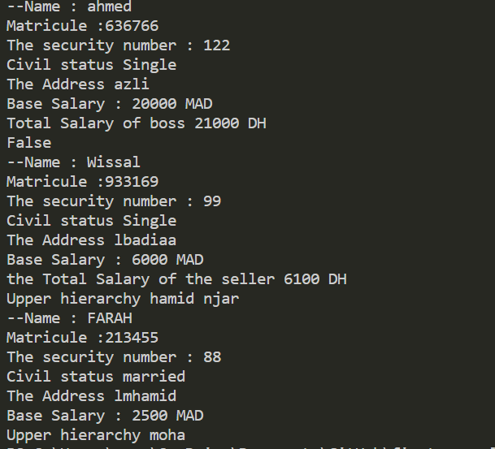

# Employee_Management_System
This Python code implements a basic Employee Management System using object-oriented programming principles.
The system defines an abstract base class (SALARIER) for employees with common attributes like name, social security number, marital status, address, and salary. Subclasses (PATRON, VENDEUSE, and Caisiere) extend the base class to represent different types of employees such as bosses, sellers, and cashiers.

Each subclass introduces specific attributes (e.g., bonus, commission, and upper hierarchy) and overrides methods like SalairTotal and __str__ to calculate total salaries and provide formatted string representations. The code demonstrates the use of abstract methods, inheritance, encapsulation, and polymorphism to create and manage instances of various employee types.

